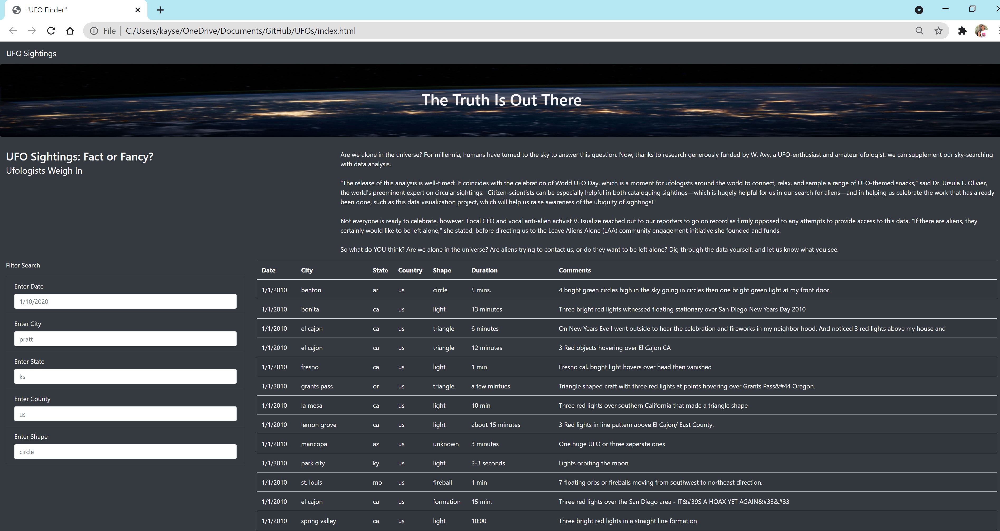
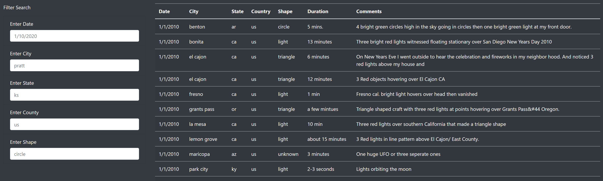
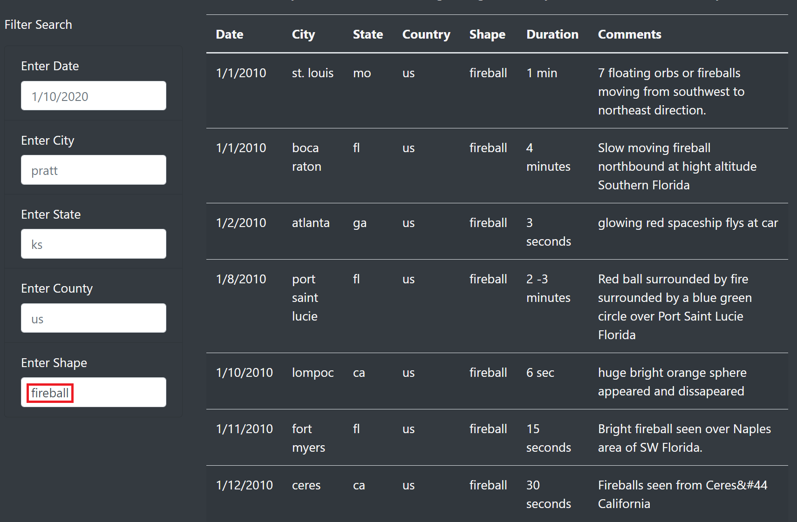
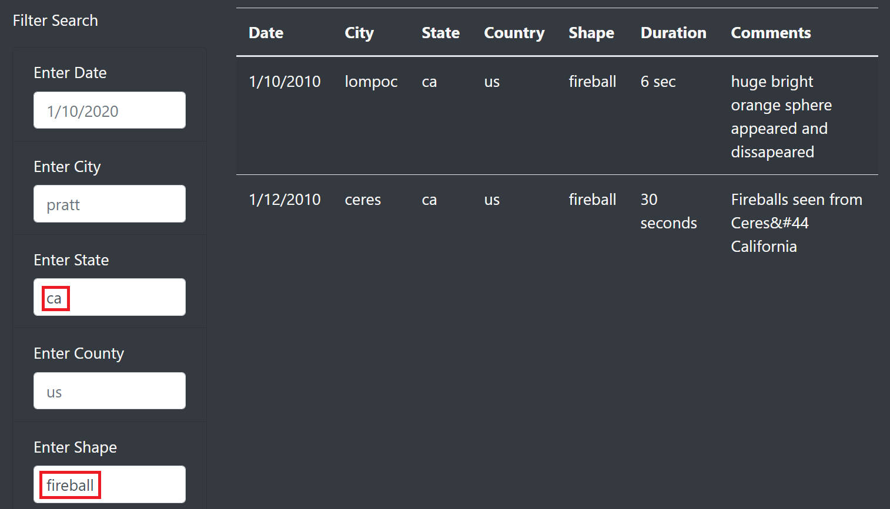
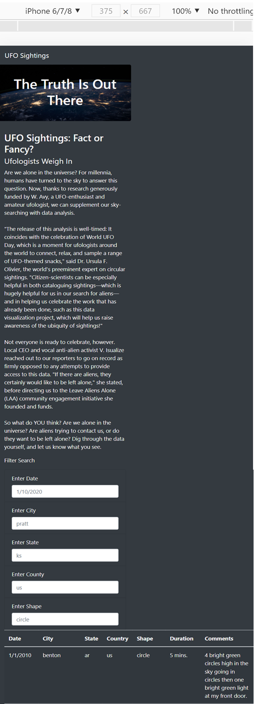
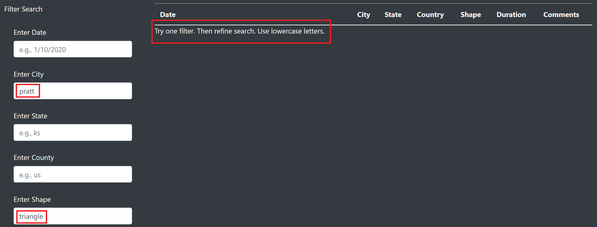

# "UFO Finder" Webpage

  

## Table of Contents
* [Overview](https://github.com/rkaysen63/UFOs/blob/master/README.md#overview)
* [Resources](https://github.com/rkaysen63/UFOs/blob/master/README.md#resources)
* [Results](https://github.com/rkaysen63/UFOs/blob/master/README.md#results)
* [Summary](https://github.com/rkaysen63/UFOs/blob/master/README.md#summary)

## Overview:
This data visualization project is a webpage that will allow the user to search for UFO sightings using one or more filters.  The filters include date of the sighting ("Date"), location of the sighting ("City", "State", and/or "Country") and the observed shape of the UFO ("Shape").  The UFO sightings data includes datetime, city, state, country, shape, durationMinutes, and comments that are held in a JavaScript object.  Users are encouraged to look through and filter the data displayed on the webpage and come to their own conclusions about the existence of alien life.

## Resources:

* UFO Sightings Data File: data.js
* Jumbotron Background Image: nasa.jpg
* Tools: 
  * JavaScript
  * HTML
  * CSS
  * Bootstrap 4 library  
* Lesson Plan: UTA-VIRT-DATA-PT-02-2021-U-B-TTH, Module 11 Challenge

## Results:

### Code files used to create the "UFO Finder" webpage
* style.css
  * This file provides additional Bootstrap CSS styling.
* index.html
  * This file creates the basic webpage.
* data.js
  * This JavaScript file holds a variable containing an array [] of JavaScript objects {key: value pairs} that are the dataset that is used to build the Table of UFO sightings.
* app.js
  * This file contains functions that can iterate through the rows of filtered data to populate the data Table with values returned as a result of filtering.

### Filter Search

    Filter Search  

The "Filter Search" allows the user to use one or more of the filters at a time.  The search will become more refined by the number of filters selected.  The "Filter Search" boxes contain placeholders when the webpage is opened that provide an example of the text to be entered into the user input box. In addition, the full table of data is displayed to the right of the "Filter Search" box so that the user may scroll through all of the data before refining a search.  The HTML code below shows the unordered list that holds the "Filter Search" user boxes. Within each list `<li />` element is a label element `<label for="city">Enter City</label>` and an input element `<input type="text" placeholder="pratt" id="city" class="form-control" />`.  The JavaScript code will look for the `id` attribute within the input element. `class="form-control` identifies this element as a user-input form.  
          
        <!-- Create a set of list tags within an unordered list tag -->
        <ul class="list-group bg-dark">
            <li class="list-group-item bg-dark">
                <!-- label for each search parameter -->
                <label for="date">Enter Date</label>
                <!-- input element that provides the input box -->
                <input type="text" placeholder="1/10/2020" id="datetime" class="form-control"/>     
            </li>
            <li class="list-group-item bg-dark">
                <label for="city">Enter City</label>
                <input type="text" placeholder="pratt" id="city" class="form-control" /> 
            </li>
            <li class="list-group-item bg-dark">
                <label for="state">Enter State</label>
                <input type="text" placeholder="ks" id="state" class="form-control" />  
            </li>
            <li class="list-group-item bg-dark">
                <label for="country">Enter County</label>
                <input type="text" placeholder="us" id="country" class="form-control" />  
            </li>
            <li class="list-group-item bg-dark">
                <label for="shape">Enter Shape</label>
                <input type="text" placeholder="circle" id="shape" class="form-control" />  
            </li>
        </ul>

* To filter the data, enter text into one or more of the input boxes, or "Filter Search," boxes in the same format as shown by the placeholder.  The date format is m/dd/yyyy; Text is written lower case letters; Two-letter state codes are used rather than the full state name.  
    
  For example, type in "fireball" in the "Enter Shape" user input box, followed by "ca" in the "Enter State" user input box.
    

    Filter Search for "fireball"

    

* The table reacts immediately.  First, after "fireball" is typed and entered in the "Enter Shape" user box, all of the instances where "fireball" is observed is displayed. Then after "ca" is typed and entered in the "Enter State" user box, only those instances where "fireball" is observed in "ca" are displayed.   
      

    Filter Search for "fireball" and "ca"

    

   * The table reacts immediately upon the entry of the first filter because the event listener is looking for change.  

          // Event listener - listens for changes to each filter
          d3.selectAll("input").on("change", updateFilters);

   * After "fireball" is entered either by pressing "enter" or by typing in the second filter box, the event listener notices the change and calls the `updateFilters()` function.  The `updateFilters()` function updates the filters after receiving input and initializes an array to hold the id and value of the element(s) that changed.

          function updateFilters() {

              // Initialize an array to store the value and id of the changed element.
              let changedElement = d3.select(this);

              // Save the value that was changed as a variable.
              let elementValue = changedElement.property("value");
              console.log(elementValue);

              // Save the id of the filter that was changed as a variable.
              let filterId = changedElement.attr("id");
              console.log(filterId);

              // If a filter value was entered then add that filterId and value to the filters list. 
              // Otherwise, clear that filter from the filters object.
              if (elementValue) {
                filters[filterId] = elementValue;
              }
              else {
                delete filters[filterID];
              }
              console.log(filters);
              // Call function to apply all filters and rebuild the table
              filterTable();
            }
   
   * The `updateFilters()` function calls the `filterTable()` function to filter the table based on the user input, i.e. filter(s).  The function takes the user input, loops through the `tableData` which is an array JavaScript objects and keeps only those objects where there is a match between key, value of the filters and key, value in the object.
    
         function filterTable() {

           let filteredData = tableData;

           // Loop through all of the filters and keep any data that matches the filter values
           Object.entries(filters).forEach(function([kee, val]) {
             // if the value is not empty then filteredData = data set that matches filters
             if (val != "") {
               filteredData = filteredData.filter(row => row[kee] === val);
             }
           });
           // Finally, rebuild the table using the filtered data
           buildTable(filteredData); 
         };
   
   * The `filterTable()` function calls the `buildTable()` function that builds the table per the filter(s).  In the example, the table is built using JavaScript objects containing the shape, "fireball", and as we will see later, shape, "fireball", and state, "ca".
   
          function buildTable(data) {
            // First, clear out any existing data
            tbody.html("");

            // Next, loop through each object in the data
            // and append a row and cells for each value in the row
            data.forEach((dataRow) => {
              // Append a row to the table body
              let row = tbody.append("tr");

              // Loop through each field in the dataRow and add
              // each value as a table cell (td)
              Object.values(dataRow).forEach((val) => {
                let cell = row.append("td");
                cell.text(val);
              });
            });
          }
   
   * Then after "ca" is entered, the event listener notices the change and calls the `updatedfilters()` function again and the process is repeated but now it's filtering both "fireball" and "ca".

*  Due to the Bootstrap 4 grid system this webpage is responsive and can be viewed on smaller screens such as mobile devices.

    Mobile Ready!

## Summary:

### Drawbacks:
Two drawbacks of this webpage were easily remedied.
   * The placeholder text is light grey but is barely distinguishable from the input text.  For this reason, "e.g., " was added in front of each placeholder text so that it would be more apparent that it is an example rather than an actual filter.  The filtered text will be more readily recognizable because it won't have "e.g, " in front of it.
   * If the input doesn't match for various reasons such as wrong case, or the input or combination of inputs does not exist, then an empty table is returned.  There's no additional guidance.  For this reason, I added, a message, "Try one filter.  Then refine search. Use lowercase letters."

    Message Returned when Filters do not Yield Table Data

### Recommendations:
The following recommendations for further development would require some effort but would greatly enhance this webpage.
   * Consider pulling data from multiple websites either by web scraping and/or APIs.  The current dataset is limited to sightings that occur in January of 2010.  It's difficult to come to any real conclusions on such a small number of incidences.
   * Consider adding a map that shows the location of each sighting with pop-up information boxes.  Not only would it add interest, it could also provide a visualization of the density of sightings in certain areas.

[Back to the Table of Contents](https://github.com/rkaysen63/UFOs/blob/master/README.md#table-of-contents)
